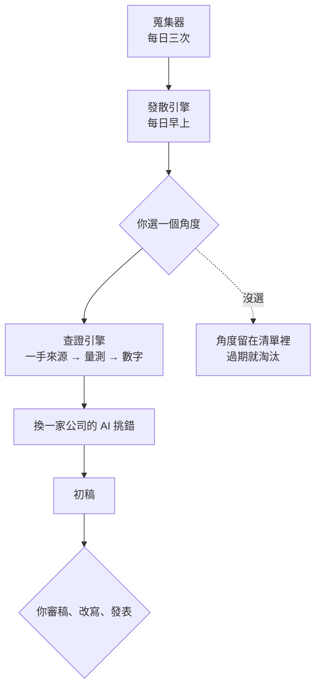

# 研究出版系統

## 構想

做加密貨幣內容的人每天滑兩三小時，不是因為找不到新聞——新聞到處都是。真正的問題是：**看到一則東西，腦子裡冒出「欸這背後好像有什麼」，但那個念頭沒有人陪你往下推。**

舉個實際的例子。Arc 快上線時，有人發推教大家怎麼準備玩 Arc 的 meme。這則貼文本身沒什麼好寫的，但它後面有三四層：

- 為什麼注意力集中在 meme 而不是空投？以往新鏈上線，大家都在刷空投
- 如果行為真的變了，是空投預期崩壞、meme 基建成熟，還是這條鏈本來就沒空投可期待？
- 站在項目方角度，空投跟養 meme 哪個帶來更多資金與流量？

於是我打算做一個研究助理。每天自動蒐集加密貨幣資訊，把其中值得深挖的觀察展開成六個角度；你挑一個，它把能用數據回答的部分查證完，產出一篇可以發表的初稿。

它不是新聞摘要工具，不是自動發文機器人，也不做交易訊號。輸出是可驗證的事實與數字，發不發、怎麼寫由人決定。

### 核心：六軸發散

看到任何一個觀察，系統用六個固定的軸各問一次：

| 軸 | 問什麼 |
| --- | --- |
| 行為反常 | 誰的行為跟歷史不一樣？注意力、資金、參與者組成哪一項偏離了 |
| 環境歸因 | 如果真的變了，是什麼結構改變造成的？列出**互斥**的競爭解釋 |
| 換位 | 換一個角色看，他的算盤是什麼 |
| 機制連鎖 | A 發生 → 誰被迫做 B → 誰承受 C |
| 時間結構 | 有沒有固定時點造成的週期性 |
| 反面 | 如果這說法是錯的，會看到什麼 |

軸是固定的，這很重要——**固定的軸會逼你問出自己原本不會問的那一題**。你本來只想到「注意力跑去 meme 了」，但「換位」這個軸會強迫你算一次項目方的帳。

### 每個角度標三種狀態，三種都留

- **現在可量**——資料拉得到，今天就能算 → 進查證流程
- **要等事件**——需要某個時點才有對照 → 先建基準線
- **只能推演**——沒有公開資料可驗 → **留著當觀點文素材**

第三類是這個產品跟「數據工具」最大的差別。大部分系統會把不可量的東西丟掉，但一個內容創作者真正有辨識度的文章，常常就寫在那裡。規則是：同一個推演被三個不同觀察指到，就值得單獨寫一篇。

### 可量的那部分，才啟動重機具

選中一個「現在可量」的角度之後，系統才開始做貴的事：讀一手來源、寫量測程式、跑數字。三個機制保證這部分能信：

**資訊分三層**——抓進來的、自己量過的、已被推翻的，分開存放。量過的數字必須標量測日期，鏈上參數會變。

**換一家公司的 AI 來挑錯**——只給結論、數據、方法，不給推理過程。看過推理鏈的審查者會被說服。

**每個結論押一條可驗證的預測**——三個月後看哪個數字、門檻多少、當初為什麼這樣想。到期自動判定。

---

## 怎麼運作

系統由四個元件組成，只有中間兩個用到 AI：

| 元件 | 做什麼 | 何時跑 | 用 AI 嗎 |
| --- | --- | --- | --- |
| 蒐集器 | 抓新聞媒體、治理論壇、官方公告、學術預印本，存成統一格式並標為未查證 | 每天三次，自動 | 否，純腳本 |
| 發散引擎 | 挑 3–5 個最有延伸空間的觀察，每個用六軸展開 4–6 個角度 | 每天早上一次，自動 | 是 |
| 查證引擎 | 讀一手來源、寫量測程式、跑數字、找另一個 AI 挑錯、產出初稿 | 你選題後才啟動 | 是 |
| 手機端 | 推送當日重點、看角度清單、選題、隨手丟想法 | 常駐 | 否，純腳本 |

實線都是自動的，兩個菱形是人的介入點。**人一天只需要出現兩次**：選題三到五分鐘，審稿三十到六十分鐘。

蒐集器抓進來的東西永遠標為未查證，不能直接當事實引用；只有查證引擎量過的數字才會進知識庫，而且必須標量測日期——鏈上參數會變，沒有日期的數字視同不可信。

---

## 使用場景

系統跑在自己的電腦上，日常操作透過 Telegram 機器人：

| 指令 | 做什麼 |
| --- | --- |
| `/news` | 當日重點，已去重並過濾行情雜訊 |
| `/topics` | 今天的觀察與角度清單 |
| `/pick 3b` | 選第 3 個觀察的 b 角度 |
| `/note <文字>` | 隨手丟一個想法進待辦 |
| `/status` | 最後蒐集時間、待結算預測、最新草稿 |
| `/draft` | 最新初稿，可看全文或收檔案 |

一天的節奏：早上收到當日重點（約 20 則，從兩三百則篩過）與角度清單，有空時滑一下點個號碼；想做的時候跟系統說開工，它從佇列接手跑完整條流程；初稿回來後自己審稿、改寫、發表。

**不選題沒有任何代價。** 這是刻意設計的——有產量壓力的系統會逐步降低標準。

要跑起來需要：一個 AI 訂閱方案、一個 Telegram 機器人（免費）、一台會開著的電腦，以及看得懂程式輸出的基本能力。沒有伺服器、沒有付費資料源、沒有付費 API，所有資料都來自公開端點。

關機不會壞掉任何東西，開機後自動補跑，但**關機期間的新聞補不回來**：補跑只抓得到當下最新的，中間那段是永久缺口
