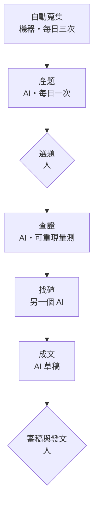

# 研究出版系統：動機、適用對象、運作流程

這套系統把「每天滑資訊找題目」換成「每天收一份題目清單」，再用可重現的實測把選中的題目查證成一篇有一手數據的文章。人只做兩件事：選題、審稿。

## 為什麼做

做加密貨幣內容的人，靈感幾乎都來自滑推文和看新聞——而這件事每天要花掉兩三個小時，且無法外包給別人的摘要，因為看摘要就看不到「值得深挖的那一句」。

更根本的問題是：**速度這條路走不通。** 一則消息出來，全世界的帳號在十分鐘內都會轉完，比誰快贏不了機構媒體，比誰轉得多贏不了農場號。剩下唯一的差異化是**一手查證**——同樣一則新聞，別人轉述，你把數字自己量一遍。

但一手查證很貴。要讀原始文件、寫程式拉鏈上資料、跟聚合器的數字對帳。一個人一週能做一到兩次，做不到每天。

所以這套系統的分工是這樣切的：

- **找題目**交給機器做，每天自動產出一份候選清單
- **查證**半自動，人決定查哪題，AI 寫量測程式並跑出數字
- **判斷與發文**完全留給人，AI 不碰帳號

目標不是產量，是把「值得查的題目」送到眼前，讓人把時間花在決定查什麼、以及最後的判斷上。

## 適合誰

這套系統的前提是：**你靠「比別人查得深」取勝，不是靠比別人快。**

適合：

- **寫研究型內容的個人作者**——一個人、沒有編輯台、需要穩定產出有深度的東西
- **有技術背景但時間不夠的人**——懂怎麼驗證，卡在「每天先要花三小時才知道要驗證什麼」
- **跟一個垂直領域的人**（不限加密貨幣）——只要資料公開、可以程式化取得，換個領域也成立

不適合：

- **想讓 AI 自動發文的人**。這套系統刻意把發文權留在人手上，每一篇都要人審過、改過才能上。
- **想拿來做交易訊號的人**。它輸出的是可驗證的事實與數字，不推導買賣建議。
- **一週要發五篇的人**。一輪完整查證要半天到一天，深度跟頻率在這裡是直接衝突的。

還有一條界線值得講清楚：**它不能替你判斷什麼題目有趣。** 系統能過濾掉雜訊、能確認資料拿不拿得到、能把數字量出來，但「這件事為什麼值得寫」這個判斷沒有被自動化，也不應該被自動化。

## 運作流程

六個步驟，人只在第二步和第六步出現。

**一、自動蒐集（機器）**　每天固定時間抓新聞媒體、治理論壇、官方公告、學術預印本。抵達的東西一律標為未查證，永遠不能直接當事實引用。這一步沒有 AI 參與——讓 AI 每天讀幾百則新聞是成本黑洞，而且沒必要。

**二、產題（AI）**　每天早上自動跑一次，挑出十到十五個候選題目。每題必須含四樣東西：事件是什麼、**要用數據回答的具體問題**、打算怎麼查、資料來源。寫不出「打算怎麼查」的題目不准進清單——這條規則擋掉很多看起來誘人、實際上無法驗證的題目。

**三、選題（人）**　清單推到手機，滑一下，點一個編號。這是人的第一個介入點，花不到五分鐘。

**四、查證（AI）**　順序不可調換：先讀一手來源（原始公告、法律文件、合約），再寫量測程式，最後才下結論。所有程式都要能重跑出同一個數字，結論要收斂成**一個數字**。

**五、找碴（換一個 AI）**　把結論、數據、方法交給另一家公司的 AI，**但不給推理過程**——看過推理鏈的審查者會被說服，那就失去意義了。它提的每一條要逐條裁決，能用數據回應的就再量一次。

**六、成文與審稿**　AI 寫草稿，開頭必須附一段「審稿前情提要」：事件時間線、哪些是一手哪些是轉述、哪些地方最該被挑戰。人審完、改完，自己發。

## 三個關鍵設計

這三個是系統能不能信的分水嶺，也是它跟「讓 AI 寫一篇給我」最大的差別。

**一、資訊分三層，不可混用**

抓進來的原始資訊、自己量過的數字、已經被推翻的說法，分開存放。自己量過的數字還要標三件事：多有把握、哪一天量的、現在還算不算數。

「哪一天量的」這欄是特別加的：鏈上參數會變，**沒有量測日期的數字視同不可信**。被推翻的說法不刪，留著——錯在哪裡比猜對什麼更有用。

**二、找碴要換一家公司的 AI**

同一個 AI 審自己的結論等於沒審。所以查證完成後，結論會被送到另一家公司的模型手上，要求它攻擊。

實際跑了三輪，實測結果：**它標「致命傷」的那一條，三次都不致命**（其中兩次實測後發現方向相反）。但三次都指出了真問題。結論是：**價值在它指的方向，不在它的嚴重度評級**，所以每一條都要實測完再裁決，不採用它的總評。

**三、每個結論都押一條可驗證的預測**

每一篇發出去的東西，都要同步登記一條到期可以機械判定的預測：寫清楚三個月後要看哪個數字、門檻是多少、當初為什麼這樣想。到期自動跑判定。

**這是整套系統唯一真正的回饋訊號。** 沒有它，寫錯了永遠不會知道，下一篇繼續錯。猜錯的一律結算、不刪紀錄，因為錯的那些才是唯一的學習素材。

## 一天實際長什麼樣

| 時間 | 發生什麼 | 誰做 | 人花的時間 |
| --- | --- | --- | --- |
| 早上 | 抓當日資訊，挑出重點推到手機 | 機器 | 0 |
| 早上 | 產出十到十五個候選題目 | AI | 0 |
| 隨時 | 滑題目清單、點一個編號 | 人 | 3–5 分鐘 |
| 想做時 | 一手來源→量測→找碴→草稿 | AI | 0（等） |
| 收到草稿 | 審稿、改寫、發文 | 人 | 30–60 分鐘 |

沒選題的那幾天，系統照樣跑，只是不產出文章。**不選題沒有任何代價**——這是刻意的，有產量壓力的系統會逐步降低標準。

所有自動任務跟著電腦跑。關機不會壞掉任何東西，開機後會自動補跑，但**關機期間的新聞是補不回來的**：補跑只抓得到當下最新的，中間那段就是缺口。

## 目前跑出來的東西

系統建置至今四天，跑了三輪完整研究。三輪都通過找碴這一關，其中一輪的結論被改寫過一次。

兩個具體的例子，都是媒體寫了但沒人算的數字：

- 某個協議清算時，媒體寫「百萬美元退給持幣人」。實際量完：**分母裡有 31.8% 卡在別的協議手上**，那部分人要等第二層手續。
- 監管機關發了新規，媒體標題都寫「合成型被排除，多數不適用」。量完發現：**判準根本不是「有沒有真股背書」**，三家最大的產品都有 1:1 真股託管，三家都被排除。按正確的判準逐檔分類後，可適用的最多只有 11.8%。

這兩個都不是「更快寫出來」，是「別人沒去量」。

**成本**　一個 AI 訂閱方案，加一個免費的通訊軟體機器人。沒有伺服器、沒有付費資料源、沒有付費 API。所有資料來自公開端點。

**還沒解決的**

- 社群平台的原文拉不進來（未登入的公開頁面已經殘廢），目前靠公開頻道與論壇補
- 只累積了三輪，預測還沒有任何一條到期——最快一條在十天後。在那之前，這套系統的回饋迴路還沒有真正閉合過一次。
