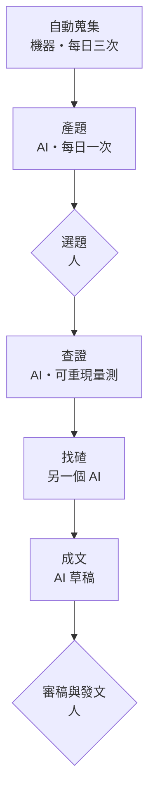

# 研究出版系統：動機、適用對象、運作流程

這套系統把「每天滑資訊找題目」換成「每天收一份題目清單」，再用可重現的實測把選中的題目查證成一篇有一手數據的文章。人只做兩件事：選題、審稿。

## 為什麼做

做加密貨幣內容的人，靈感幾乎都來自滑推文和看新聞——而這件事每天要花掉兩三個小時，且無法外包給別人的摘要，因為看摘要就看不到「值得深挖的那一句」。

更根本的問題是：**速度這條路走不通。** 一則消息出來，全世界的帳號在十分鐘內都會轉完，比誰快贏不了機構媒體，比誰轉得多贏不了農場號。剩下唯一的差異化是**一手查證**——同樣一則新聞，別人轉述，你把數字自己量一遍。

但一手查證很貴。要讀原始文件、寫程式拉鏈上資料、跟聚合器的數字對帳。一個人一週能做一到兩次，做不到每天。

所以這套系統的分工是這樣切的：

- **找題目**交給機器做，每天自動產出一份候選清單
- **查證**半自動，人決定查哪題，AI 寫量測程式並跑出數字
- **判斷與發文**完全留給人，AI 不碰帳號

目標不是產量，是把「值得研究的題目」送到眼前，讓人把時間花在決定查什麼、以及最後的判斷上。

## 適合誰

- **寫研究型內容的個人作者**——一個人、沒有編輯台、需要穩定產出有深度的東西
- **有技術背景但時間不夠的人**——懂怎麼驗證，卡在「每天先要花三小時才知道要驗證什麼」
- **跟一個垂直領域的人**（不限加密貨幣）——只要資料公開、可以程式化取得，換個領域也成立

## 運作流程

六個步驟，人只在第二步和第六步出現。

**一、自動蒐集（機器）**　每天固定時間抓新聞媒體、治理論壇、官方公告、學術預印本。抵達的東西一律標為未查證，永遠不能直接當事實引用。這一步沒有 AI 參與——讓 AI 每天讀幾百則新聞是成本黑洞，而且沒必要。

**二、產題（AI）**　每天早上自動跑一次，挑出十到十五個候選題目。每題必須含四樣東西：事件是什麼、**要用數據回答的具體問題**、打算怎麼查、資料來源。寫不出「打算怎麼查」的題目不准進清單——這條規則擋掉很多看起來誘人、實際上無法驗證的題目。

**三、選題（人）**　清單推到手機，滑一下，點一個編號。這是人的第一個介入點，花不到五分鐘。

**四、查證（AI）**　順序不可調換：先讀一手來源（原始公告、法律文件、合約），再寫量測程式，最後才下結論。所有程式都要能重跑出同一個數字，結論要收斂成**一個數字**。

**五、找碴（換一個 AI）**　把結論、數據、方法交給另一家公司的 AI，**但不給推理過程**——看過推理鏈的審查者會被說服，那就失去意義了。它提的每一條要逐條裁決，能用數據回應的就再量一次。

**六、成文與審稿**　AI 寫草稿，開頭必須附一段「審稿前情提要」：事件時間線、哪些是一手哪些是轉述、哪些地方最該被挑戰。人審完、改完，自己發。

## 一天實際長什麼樣

| 時間 | 發生什麼 | 誰做 | 人花的時間 |
| --- | --- | --- | --- |
| 早上 | 抓當日資訊，挑出重點推到手機 | 機器 | 0 |
| 早上 | 產出十到十五個候選題目 | AI | 0 |
| 隨時 | 滑題目清單、點一個編號 | 人 | 3–5 分鐘 |
| 想做時 | 一手來源→量測→找碴→草稿 | AI | 0（等） |
| 收到草稿 | 審稿、改寫、發文 | 人 | 30–60 分鐘 |
